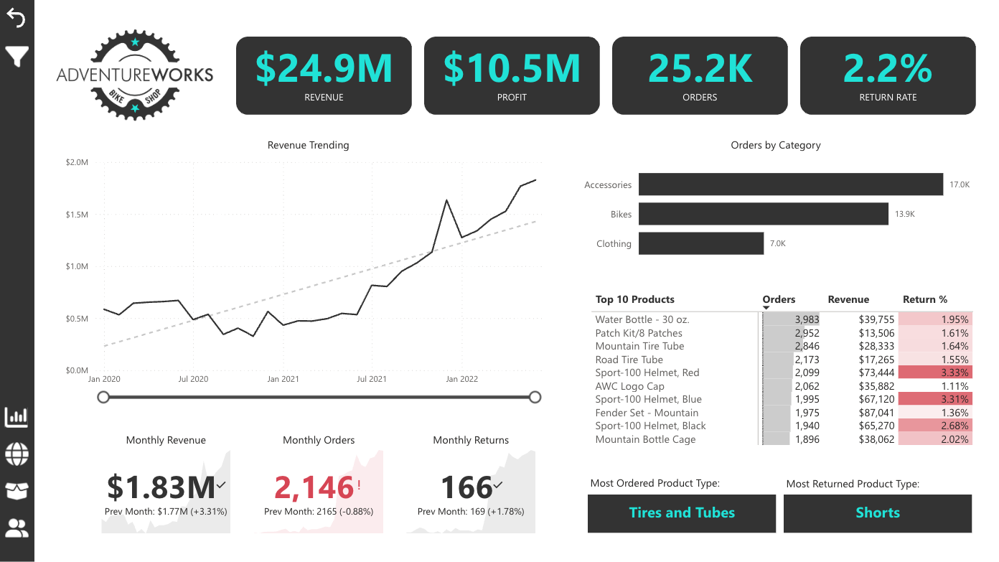
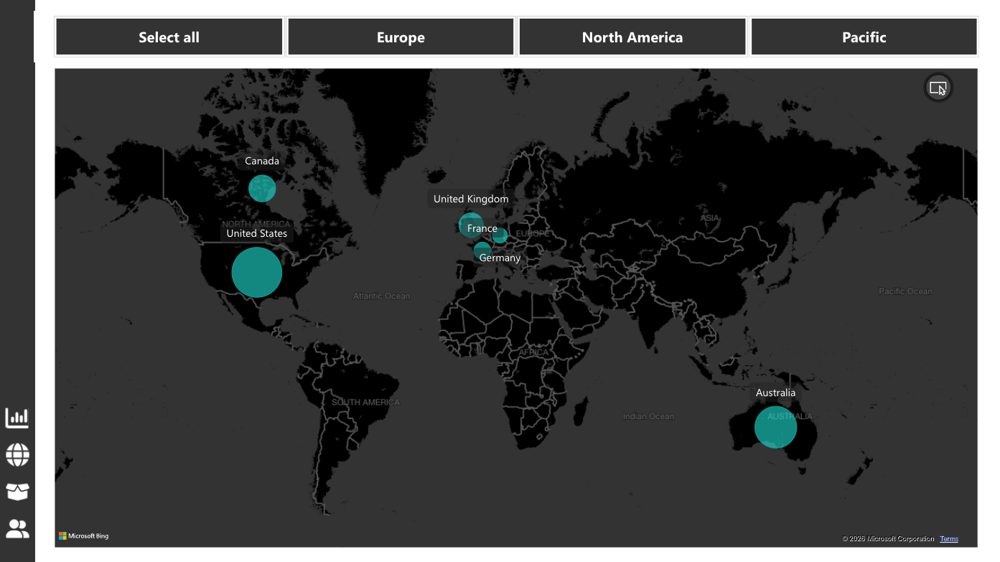
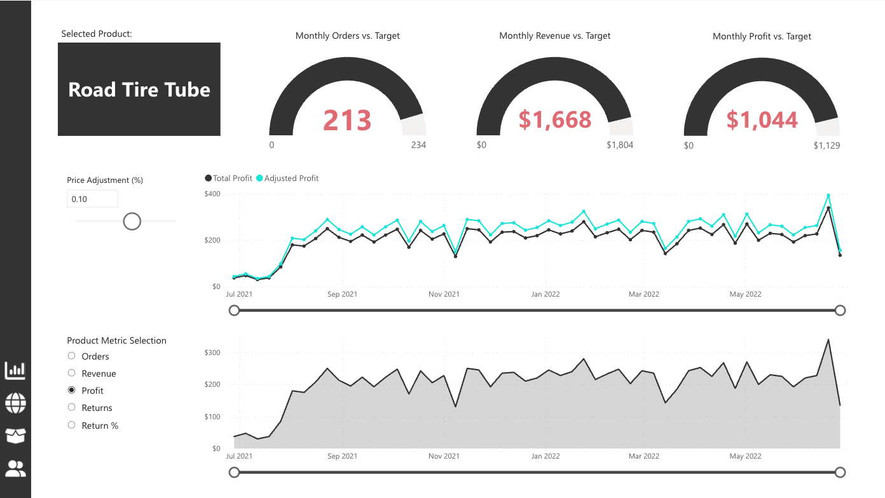
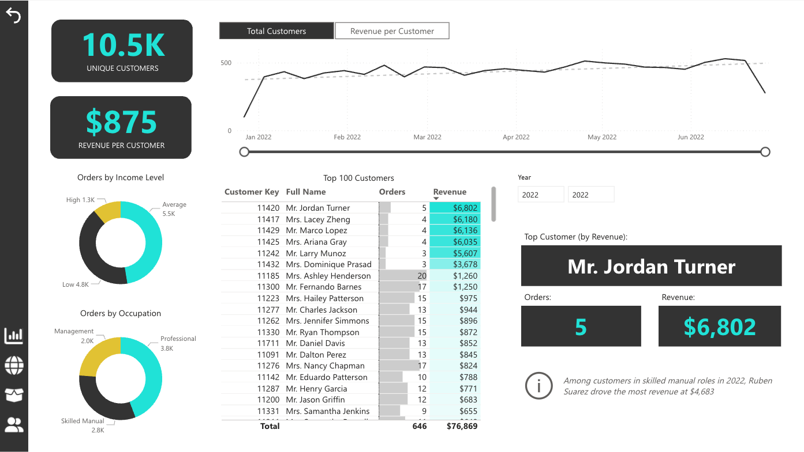

# Adventure Works Bike Shop - Power BI Dashboard

Interactive business intelligence dashboard for Adventure Works, focused on revenue performance, product trends, return behavior, and customer insights.

## Business Objective

Build an executive-ready dashboard to monitor sales health and help business users answer:

- Which products and categories drive the most revenue and profit?
- How are sales and returns trending over time?
- Which geographies and customer segments need attention?

## Project Structure

```text
Power-BI-Adventure-Works-Dashboard/
|- Data/                 # Source CSV files used for modeling
|- Reports/              # Power BI report files (.pbix / .pbip)
|- Documentation/        # Data dictionary, DAX notes, design decisions
|- Assets/
|  |- Branding/          # Icons/logo used in report pages
|  `- Screenshots/       # Dashboard previews for GitHub
`- README.md
```

## What's Included

- `Reports/AdventureWorks Report_FINAL.pbix`: completed dashboard report
- `Reports/AdventureWorks Report_Visualization Complete.pbip`: Power BI Project entry file for version control
- `Assets/Screenshots/adventureworks-dashboard-01.png` … `adventureworks-dashboard-04.png`: report previews for GitHub
- `Data/*.csv`: raw and lookup datasets used in the model
- `Assets/Branding/*.png`: icons and brand assets used in report design

## Dashboard previews

Static previews of the report (no Power BI install required to browse the repo).









## Power BI Project Format (PBIP)

For best GitHub collaboration and cleaner diffs, this project includes a `.pbip` source file in `Reports/` (in addition to the `.pbix` deliverable).

1. Open the report in Power BI Desktop.
2. Enable **Power BI Project (.pbip)** preview in options.
3. Save as `.pbip` into `Reports/`.
4. Commit the generated project folders/files.

Keep the `.pbix` as an optional distributable backup.

Note: a `.pbip` references companion project folders (for example, a `.Report` folder). Include those folders in `Reports/` so the project opens correctly from source-controlled files.

## Technical Highlights

- Data model built from sales fact tables and lookup dimensions.
- Power Query used for data shaping and table prep.
- DAX measures used for KPI tracking and trend analysis.
- Dashboard pages designed for quick executive scanning and drilldown.

## GitHub Presentation Checklist

To make this project highly interactive and recruiter-friendly, add the following:

1. **Screenshots**: PNGs live in `Assets/Screenshots/` with names `adventureworks-dashboard-01.png` … `adventureworks-dashboard-04.png` and are embedded above
2. **DAX Notes** (recommended): create `Documentation/dax-measures.md`
3. **Data Dictionary** (recommended): create `Documentation/data-dictionary.md`
4. **Live Report Link** (optional): add Power BI Publish to Web URL below

## Live Dashboard

- Power BI Service link: https://app.powerbi.com/groups/me/reports/0c30d496-30e6-409f-ac3f-6c19bafcb6b5/ReportSection28fc774ae9054691e9b4?experience=power-bi&bookmarkGuid=Bookmarkd03d17222735e25c1a41

## How To Open

1. Preferred source-controlled option: open `Reports/AdventureWorks Report_Visualization Complete.pbip` in Power BI Desktop.
2. If the `.pbip` companion folders are not present yet, open `Reports/AdventureWorks Report_FINAL.pbix` instead.
3. Verify data source paths point to files in `Data/`, refresh, and explore page filters, slicers, and visuals.
